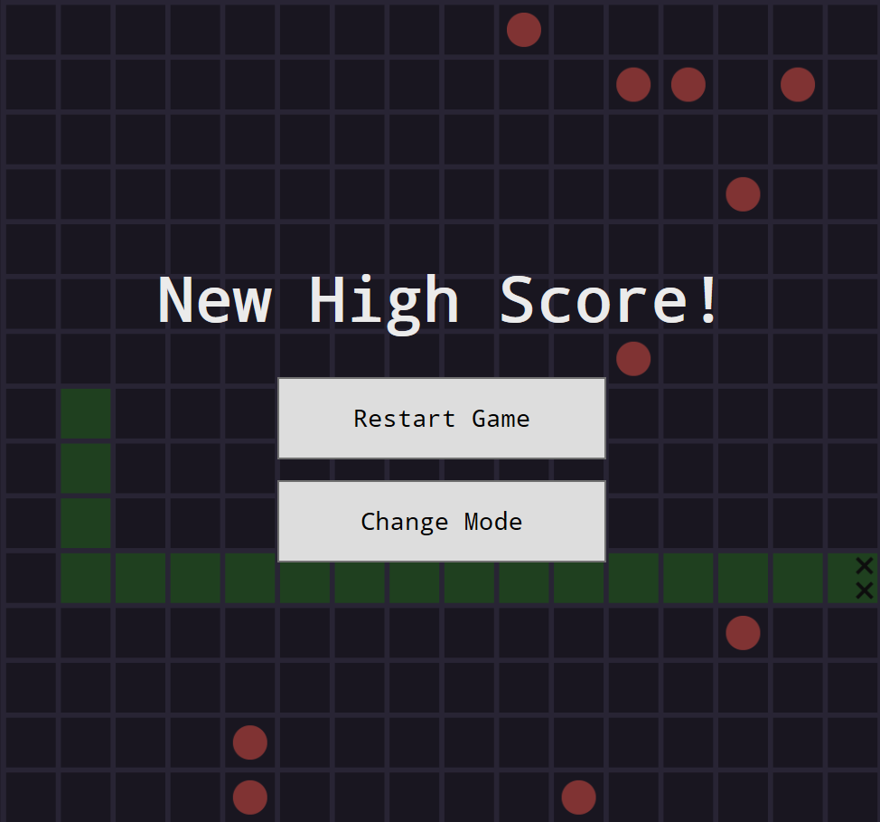
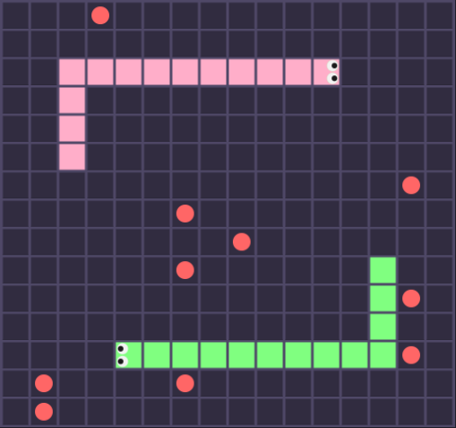

# WPF Enhanced Snake Game

A modern implementation of the classic Snake game built with C# and Windows Presentation Foundation (WPF).

This project started as a foundation based on the excellent YouTube tutorial by OttoBotCode, but has since been significantly expanded with unique game modes and mechanics.

## Preview

| Classic Mode | Two Snakes Mode |
| :---: | :---: |
|  |  |

## Features

The game features a robust classic mode alongside several new challenging variations.

### Base Game
* Smooth grid-based movement.
* Reactive UI built with WPF and XAML.
* Score tracking and game-over states.

### New Game Modes

This version introduces several exciting twists on the classic formula:

* **🍇 Poisonous Food:**
    Watch what you eat! In addition to regular apples, purple food appears on the grid. Eating it will shorten your snake instead of lengthening it.

* **🧱 Through Walls:**
    The borders are no longer deadly. The game board wraps around – moving off the edge of the screen teleports the snake to the opposite side.

* **🛡️ Immortal:**
    A relaxed but long-term challenge. The snake cannot die by hitting walls or its own body. The game ends only when the snake reaches maximum length and fills the entire grid.

* **🌀 Portals:**
    Two distinct portals spawn on the map. Entering one instantly teleports the snake's head to the other portal's location.

* **🔄 Head is Tail:**
    A disorienting challenge inspired by Google Snake. Every time the snake eats an apple, its head and tail instantly swap positions.

* **👯 Two Snakes (Mirror Mode):**
    Control two snakes simultaneously! A second snake appears on the board and moves in the exact mirror opposite direction of your inputs. Don't let either snake crash!

## Technologies Used

* C# (.NET 6.0 or higher recommended)
* WPF (Windows Presentation Foundation) for the User Interface
* XAML

## Controls

* **Arrow Keys** (or WASD): Change snake direction.

## How to Run

1.  Ensure you have the .NET Desktop Development workload installed in Visual Studio.
2.  Clone this repository:
    ```bash
    git clone [https://github.com/PatrickFongang/Snake-game.git](https://github.com/PatrickFongang/Snake-game.git)
    ```
3.  Open the solution file (`.sln`) in Visual Studio.
4.  Build the solution (Ctrl+Shift+B).
5.  Run the application (F5).

## Acknowledgments

The core structure of this project was originally based on the "Programming a Snake Game in C# - Full Guide" tutorial by **OttoBotCode**. You can watch the original tutorial [here](https://youtu.be/uzAXxFBbVoE).
